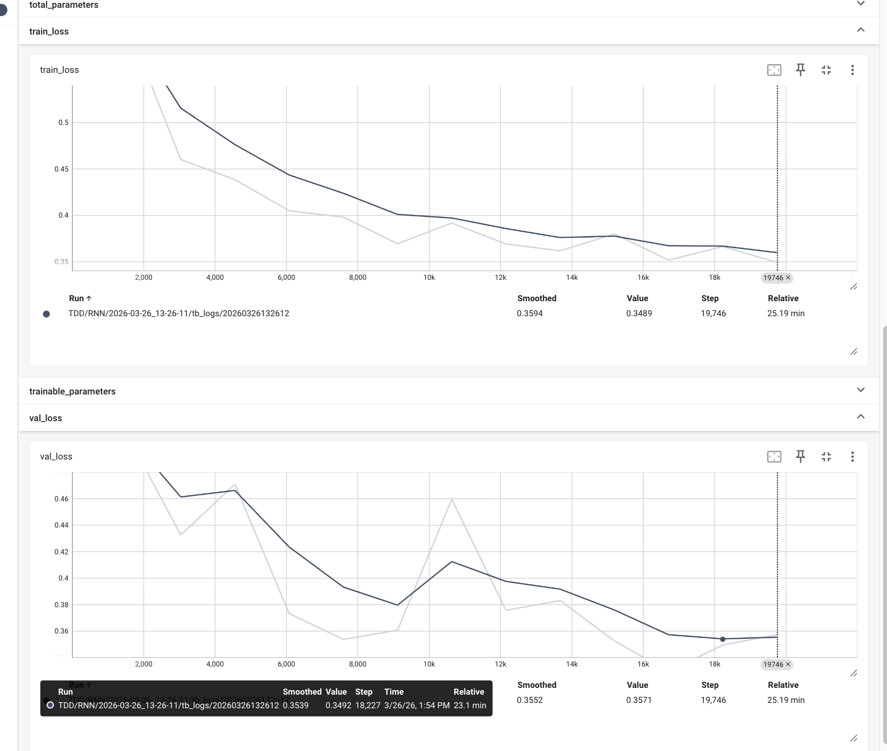
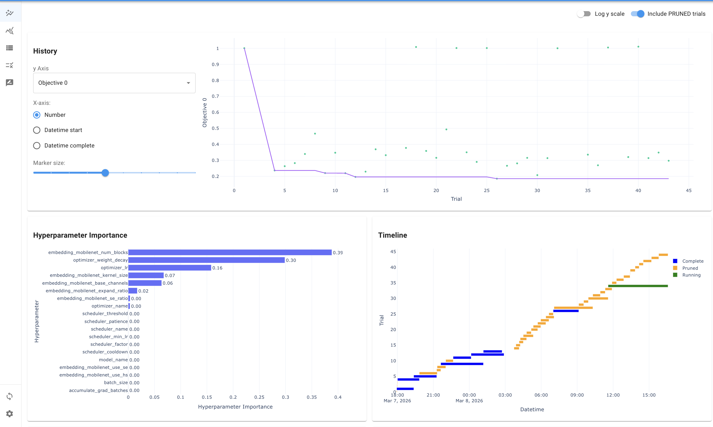
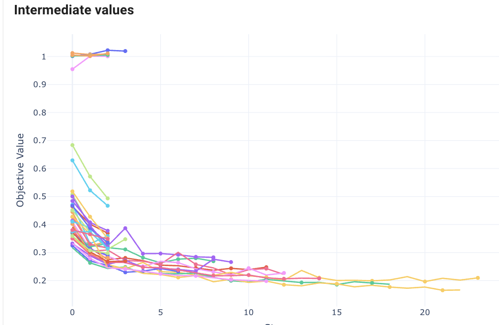

# CSI-4CAST: Channel State Information Forecasting

Copyright 2025 Georgia Institute of Technology

[](https://www.python.org/downloads/release/python-3120/)
[](LICENSE)
[](https://github.com/astral-sh/ruff)

CSI-4CAST is a comprehensive framework for generating and evaluating Channel State Information (CSI) prediction models using 3GPP TR 38.901 channel models. The repository provides tools for large-scale dataset generation, model training, and comprehensive evaluation with support for high-performance computing environments (SLURM-based clusters) and local machines.

This framework is developed as part of our research paper [**CSI-4CAST: A Hybrid Deep Learning Model for CSI Prediction with Comprehensive Robustness and Generalization Testing**](https://arxiv.org/abs/2510.12996). (A BibTeX entry for citation is provided at the end of this page.) The corresponding datasets are publicly available on our [Hugging Face organization](https://huggingface.co/CSI-4CAST).

## Updates

> [!IMPORTANT]
> - **Paper updated**: the latest version of the [paper](https://arxiv.org/abs/2510.12996) includes additional statistical baselines, expanded ablation experiments, and new discussion on the mechanism of each module in the proposed model.
> - **Model weights are now public**: all model weights (proposed, baselines, and ablation variants) are available at [CSI-4CAST/weights](https://huggingface.co/CSI-4CAST/weights). See [`z_artifacts/weights/info.md`](z_artifacts/weights/info.md) for download instructions and the expected directory structure.
> - **The tuning workflow is now included**: the reusable tuning infrastructure is in [`ahpt/`](ahpt/) and the CSI prediction tuning entry points are in [`src/cp/tune/`](src/cp/tune/). A sample Optuna study is provided in [`z_artifacts/outputs/ahpt/ablation/predictor/lstm_replace/`](z_artifacts/outputs/ahpt/ablation/predictor/lstm_replace/).
> - **Proposed model and configs provided**: the proposed CSI-4CAST models for FDD and TDD are in [`src/cp/models/proposed/`](src/cp/models/proposed/) with their default configurations (`model_fdd_cfg.yml`, `model_tdd_cfg.yml`).
> - **All ablation models are included**: the ablation study implementations are available under [`src/cp/models/ablation/`](src/cp/models/ablation/).
> - **All baselines are included**: statistical baselines in [`src/cp/models/baseline/statistical/`](src/cp/models/baseline/statistical/), learning-based baselines in [`src/cp/models/baseline/learning/`](src/cp/models/baseline/learning/), and the no-prediction baseline in [`src/cp/models/baseline/np.py`](src/cp/models/baseline/np.py).
> - **Full experiment artifacts provided**: [`z_artifacts/outputs/testing/`](z_artifacts/outputs/testing/) now contains complete results for all 9 models across both FDD and TDD scenarios, including computational overhead profiling, prediction performance for every test setting, consolidated analysis (NMSE & SE rankings), and a full visualization suite (line plots, radar charts, violin plots, and performance tables).

## Repository Structure

```
CSI-4CAST/
├── README.md                         # Project documentation
├── LICENSE                           # License information
├── env.yml                           # Conda environment configuration
├── pyproject.toml                    # Project configuration and linting rules
├── asset/                            # Figures and paper PDF for documentation
│   ├── csi-4cast-Mar-26-2026.pdf
│   ├── sample_training.png
│   ├── sample_optuna_1.png
│   └── sample_optuna_2.png
├── ahpt/                             # Reusable hyperparameter tuning utilities
│   └── base/
│       ├── config.py                 # Tuning configuration dataclasses
│       ├── submit_jobs.py            # SLURM job submission helpers
│       ├── tune_obj.py               # Optuna objective base classes
│       ├── tune_runner.py            # Study orchestration utilities
│       ├── tune_space.py             # Search-space helpers
│       └── utils.py                  # Shared tuning utilities
├── scripts/                          # HPC job scripts (SLURM templates)
│   ├── computational_overhead.sh
│   ├── cp.sh
│   ├── data_gen.sh
│   ├── nd.sh
│   ├── param_estimation.sh
│   └── testing.sh
├── src/                              # Source code
│   ├── data/                         # Data generation module
│   ├── cp/                           # Channel prediction and tuning module
│   │   ├── main.py                   # Training entry point
│   │   ├── config/                   # Training configuration management
│   │   ├── dataset/                  # Data modules
│   │   ├── loss/                     # Loss functions
│   │   ├── tune/                     # Tuning entry points and monitoring
│   │   │   ├── main.py
│   │   │   ├── monitor.py
│   │   │   ├── submit.py
│   │   │   ├── tune_obj.py
│   │   │   ├── tune_runner.py
│   │   │   └── worker.py
│   │   └── models/                   # Model registry and implementations
│   │       ├── __init__.py
│   │       ├── common/               # Shared model components
│   │       ├── proposed/             # Proposed CSI-4CAST models
│   │       ├── ablation/             # Ablation study variants
│   │       └── baseline/             # Baseline models
│   │           ├── np.py             # No-prediction baseline
│   │           ├── learning/         # CNN, RNN, STEMGNN, LLM4CP
│   │           └── statistical/      # AR, PAD, Wiener
│   ├── noise/                        # Noise modeling and calibration
│   ├── testing/                      # Evaluation and visualization
│   └── utils/                        # Shared utilities
└── z_artifacts/                      # Generated artifacts and outputs used by the codebase
    ├── config/                       # Generated configuration files
    ├── data/                         # Generated datasets and normalization stats
    ├── outputs/                      # Training, tuning, noise, and testing outputs
    └── weights/                      # Trained checkpoints organized by scenario/model
```

## Core Modules

### 1. Data Generation Module (`src/data`)

The data generation module provides a complete pipeline for creating realistic CSI datasets using 3GPP channel models.

#### Key Components:

- **[`csi_simulator.py`](src/data/csi_simulator.py)**: Configures and implements the CSI simulator based on [Sionna's](https://github.com/NVlabs/sionna) 3GPP TR 38.901 channel model implementation. The simulator generates realistic channel responses for various propagation scenarios including different channel models, delay spreads, and mobility conditions.

- **[`data_utils.py`](src/utils/data_utils.py)**: Defines all simulation parameters and constants following the specifications detailed in the research paper. This includes antenna configurations, OFDM parameters, subcarrier arrangements, and dataset organization structures.

- **[`generator.py`](src/data/generator.py)**: Employs the CSI simulator to generate comprehensive datasets including:
  - Training datasets for model development
  - Regular testing datasets for standard and robustness evaluation
  - Generalization testing datasets for generalization evaluation

#### Dataset Generation

The generator creates three types of CSI data files for each channel configuration:
- `H_U_hist.pt`: Uplink historical CSI data (model input)
- `H_U_pred.pt`: Uplink prediction target CSI data
- `H_D_pred.pt`: Downlink prediction target CSI data (for cross-link scenarios)

**Data Dimensions:**
- **Antennas**: 32 (4×4×2 dual-polarized BS antenna array)
- **Time slots**: 20 total (16 historical + 4 prediction)
- **Subcarriers**: 300 each for uplink and downlink (750 total with gap)
- **Channel models**: A, C, D (regular) / A, B, C, D, E (generalization)
- **Delay spreads**: 30-400 nanoseconds
- **Mobility scenarios**: 1-45 m/s

### 2. Channel Prediction Module (`src/cp`)

The channel prediction module provides a comprehensive framework for training CSI prediction models using PyTorch Lightning.

#### Key Components:

- **[`main.py`](src/cp/main.py)**: Training entry point that orchestrates the entire training process
- **[`config/config.py`](src/cp/config/config.py)**: Configuration management system for training parameters, model settings, and hyperparameters
- **[`dataset/data_module.py`](src/cp/dataset/data_module.py)**: PyTorch Lightning data modules for efficient data loading and preprocessing
- **[`tune/`](src/cp/tune/)**: CSI prediction tuning workflow including SLURM submission, Optuna workers, and dashboard monitoring
- **[`models/`](src/cp/models/)**: Model architectures including:
  - **[`__init__.py`](src/cp/models/__init__.py)**: PREDICTORS registry for model selection
  - **[`common/base.py`](src/cp/models/common/base.py)**: BaseCSIModel class that all models inherit from
  - **[`proposed/`](src/cp/models/proposed/)**: Proposed CSI-4CAST models for FDD and TDD
  - **[`ablation/`](src/cp/models/ablation/)**: Ablation models for denoiser, ARL, IDFT, embedding, and predictor studies
  - **[`baseline/`](src/cp/models/baseline/)**: Baseline implementations including NP, AR, PAD, Wiener, CNN, RNN, STEMGNN, and LLM4CP
- **[`loss/loss.py`](src/cp/loss/loss.py)**: Custom loss functions optimized for CSI prediction tasks

### 3. Noise Module (`src/noise`)

The noise module handles realistic noise modeling and parameter calibration for comprehensive testing scenarios.

#### Key Components:

- **[`noise.py`](src/noise/noise.py)**: Core noise generation functions implementing various realistic noise types
- **[`noise_degree.py`](src/noise/noise_degree.py)**: Noise parameter calibration system that maps target SNRs to appropriate noise parameters
- **[`noise_testing.py`](src/noise/noise_testing.py)**: Noise testing utilities and configurations
- **[`results/decide_nd.json`](src/noise/results/decide_nd.json)**: Pre-calibrated noise degree mapping for different noise types

### 4. Testing Module (`src/testing`)

The testing module provides comprehensive evaluation frameworks for CSI prediction models across multiple dimensions.

#### Key Components:

- **[`config.py`](src/testing/config.py)**: Testing configuration including model lists, scenarios, noise types, and job allocation settings
- **[`get_models.py`](src/testing/get_models.py)**: Model loading utilities with checkpoint path management
- **[`computational_overhead/`](src/testing/computational_overhead/)**: Performance profiling for measuring model computational requirements
- **[`prediction_performance/`](src/testing/prediction_performance/)**: Accuracy evaluation across thousands of testing scenarios
- **[`results/`](src/testing/results/)**: Result processing pipeline including completion checking, data aggregation, and statistical analysis
- **[`vis/`](src/testing/vis/)**: Comprehensive visualization suite generating line plots, radar charts, violin plots, and tables

## Usage Guide

The CSI-4CAST framework is designed to be flexible. Data generation, model training, noise calibration, results processing, and visualization all run locally. Prediction performance testing is designed for SLURM-based HPC clusters but can also be run locally by setting the `SLURM_ARRAY_TASK_ID` environment variable.

### Environment Setup

```bash
module load mamba/[mamba_version]
mamba env create -f env.yml
mamba activate csi-4cast-env
```

### 1. Data Generation

The code related to data generation is in the [`src/data`](src/data) folder and [`src/utils/data_utils.py`](src/utils/data_utils.py) file.

#### Define Constants

The [`data_utils.py`](src/utils/data_utils.py) file defines all constants which configure the Sionna simulator and data generation process. It is critical to understand and adjust these constants based on your setting before running any code.

#### Generate Data

For high-performance computing, use the template in [`scripts/data_gen.sh`](scripts/data_gen.sh):

```bash
python3 -m src.data.generator --is_train              # Generate training data, typical array size is 1-9
python3 -m src.data.generator                         # Generate regular test data, typical array size is 1
python3 -m src.data.generator --is_gen                # Generate generalization test data, typical array size is 1-20
```

For local/single-node execution, use debug mode for minimal datasets:

```bash
python3 -m src.data.generator --debug --is_train      # Debug mode: minimal training data
python3 -m src.data.generator --debug                 # Debug mode: minimal test data
python3 -m src.data.generator --debug --is_gen        # Debug mode: minimal generalization data
```

#### Using Pre-Generated Datasets

All datasets used in the paper are publicly available on our [Hugging Face organization](https://huggingface.co/CSI-4CAST). You can download them individually or in bulk using the provided helper scripts:

```bash
python3 z_artifacts/data/download.py              # Download all datasets from Hugging Face
python3 z_artifacts/data/reconstruction.py \       # Reconstruct the original folder structure
    --input-dir datasets --output-dir z_artifacts/data
```

See [`z_artifacts/data/info.md`](z_artifacts/data/info.md) for detailed download instructions, dataset naming conventions, and the expected directory layout.

#### Obtain Normalization Stats

After data generation (or downloading), compute normalization statistics using [`src/utils/norm_utils.py`](src/utils/norm_utils.py):

```bash
python3 -m src.utils.norm_utils
```

The normalization stats will be saved in `z_artifacts/data/stats/[fdd/tdd]/normalization_stats.pkl`.

### 2. Model Training

The model training framework is built on PyTorch Lightning and located in the [`src/cp`](src/cp) folder.

#### Define Models

Models should be defined under [`src/cp/models`](src/cp/models), inherit from `BaseCSIModel` in [`src/cp/models/common/base.py`](src/cp/models/common/base.py), and be registered in the `PREDICTORS` class in [`src/cp/models/__init__.py`](src/cp/models/__init__.py). See [`src/cp/models/baseline/learning/rnn.py`](src/cp/models/baseline/learning/rnn.py) for an example implementation.

#### Configure Training

Configure the training process in [`src/cp/config/config.py`](src/cp/config/config.py), then generate configuration files:

```bash
python3 -m src.cp.config.config --model [model_name] --output-dir [output_dir] --is_U2D [True/False] --config-file [yaml/json]
```

Default output directory: `z_artifacts/config/cp/[model_name]/`

#### Train Models

```bash
python3 -m src.cp.main --hparams_csi_pred [config_file]
```

For HPC clusters, use [`scripts/cp.sh`](scripts/cp.sh). Training outputs are saved in `z_artifacts/outputs/[TDD/FDD]/[model_name]/[date_time]/` with checkpoints in `ckpts/` and TensorBoard logs in `tb_logs/`.

View training progress:
```bash
tensorboard --logdir [output_directory]/tb_logs
```

#### Sample Training Output

A sample training run is included in [`z_artifacts/outputs/TDD/RNN/`](z_artifacts/outputs/TDD/RNN/) (RNN model, TDD scenario), containing the configuration snapshot (`config_copy.yaml`), full training log (`result.log`), model checkpoints (`ckpts/`), and TensorBoard event files (`tb_logs/`). A sample configuration file is also provided at [`z_artifacts/config/cp/rnn/tdd_rnn.yaml`](z_artifacts/config/cp/rnn/tdd_rnn.yaml).

Below are the TensorBoard training and validation loss curves from this run:

<p align="center">
  
</p>

### 3. Hyperparameter Tuning

The hyperparameter tuning workflow combines the reusable tuning utilities in [`ahpt/`](ahpt/) with the CSI prediction-specific integration in [`src/cp/tune/`](src/cp/tune/). Each study is defined by a tuning YAML that points to a base training config, a search space module, and an output directory.

#### Example Tuning Config

Use [`src/cp/models/ablation/predictor/lstm_replace/tuning.yaml`](src/cp/models/ablation/predictor/lstm_replace/tuning.yaml) as a reference. This file defines:

- the base training config in [`config.yaml`](src/cp/models/ablation/predictor/lstm_replace/config.yaml)
- the target model `ABL_LSTM_REPLACE_PRED`
- the search space in `src.cp.models.ablation.predictor.lstm_replace.tune_space`
- Optuna study settings such as `n_trials`, pruning, and early stopping
- the output directory `z_artifacts/outputs/ahpt/ablation/predictor/lstm_replace`

#### Launch a Tuning Study

```bash
python3 -m src.cp.tune.main \
    --config src/cp/models/ablation/predictor/lstm_replace/tuning.yaml \
    --num_workers 3
```

You can also override SLURM resource settings at submission time:

```bash
python3 -m src.cp.tune.main \
    --config src/cp/models/ablation/predictor/lstm_replace/tuning.yaml \
    --num_workers 3 \
    --time 08:00:00 \
    --mem 64G
```

Each study writes its artifacts under `z_artifacts/outputs/ahpt/ablation/...`, including the Optuna database, best configs, and study history.

#### Monitor Tuning Results

To inspect the discovered studies without launching dashboards:

```bash
python3 -m src.cp.tune.monitor --list-only
```

To launch Optuna dashboards for the latest study databases:

```bash
python3 -m src.cp.tune.monitor --base-port 9000
```

The monitor scans `z_artifacts/outputs/ahpt/ablation/` for `study.db` files, keeps the latest run for each ablation, and serves one dashboard per study on consecutive ports.

#### Sample Tuning Output

A sample Optuna study database is included at [`z_artifacts/outputs/ahpt/ablation/predictor/lstm_replace/`](z_artifacts/outputs/ahpt/ablation/predictor/lstm_replace/). Below are screenshots from the Optuna dashboard showing the optimization history, hyperparameter importance, trial timeline, and intermediate values:

<p align="center">
  
</p>
<p align="center">
  
</p>

### 4. Noise Degree Testing

Since realistic noise types cannot be directly defined by SNRs, calibrate noise parameters first:

```bash
python3 -m src.noise.noise_degree
```

Results are saved in `z_artifacts/outputs/noise/noise_degree/[date_time]/decide_nd.json` and copied to [`src/noise/results/decide_nd.json`](src/noise/results/decide_nd.json).

### 5. Model Testing

The model evaluation framework in [`src/testing`](src/testing) provides comprehensive assessment across multiple dimensions.

#### Configure Testing

Configure models and checkpoint paths in [`src/testing/config.py`](src/testing/config.py). Ensure checkpoints conform to the `get_ckpt_path` function in [`src/testing/get_models.py`](src/testing/get_models.py). Default checkpoint path: `z_artifacts/weights/[tdd/fdd]/[model_name]/model.ckpt`. The published experiment weights are also available from [CSI-4CAST/weights](https://huggingface.co/CSI-4CAST/weights).

#### Computational Overhead Testing

```bash
python3 -m src.testing.computational_overhead.main
```

Results saved in `z_artifacts/outputs/testing/computational_overhead/[date_time]/` for all configured models.

#### Prediction Performance Testing

First, view the testing settings and SLURM array ID mapping:

```bash
python3 -m src.testing.config
```

This prints a table showing each model/scenario/test-type combination with its SLURM array range:

```
Line  Model    Scenario  Test Type       Jobs  Array Range  Combos  Combos/Job
------------------------------------------------------------------------------
   0  PAD      TDD       regular            1  1-1             162       162.0
   1  PAD      TDD       robustness         3  2-4             486       162.0
   2  PAD      TDD       generalization    19  5-23           3060       161.1
   3  AR       TDD       regular            1  24-24           162       162.0
   ...
  45  WIENER   TDD       regular            1  346-346         162       162.0
  46  WIENER   TDD       robustness         3  347-349         486       162.0
  47  WIENER   TDD       generalization    19  350-368        3060       161.1
```

For HPC clusters, submit the desired models using the array range from the table:

```bash
sbatch --array=1-23 scripts/testing.sh      # Run all PAD tests
sbatch --array=162-184 scripts/testing.sh   # Run all MODEL TDD tests
sbatch --array=1-368 scripts/testing.sh     # Run everything
```

For local execution, set the `SLURM_ARRAY_TASK_ID` environment variable to the desired array ID from the table:

```bash
SLURM_ARRAY_TASK_ID=139 python3 -m src.testing.prediction_performance.main   # Run MODEL FDD regular
```

Results saved in `z_artifacts/outputs/testing/prediction_performance/[model_name]/[scenario]/[test_type]/[slice_i]/[date_time]/`.

#### Results Processing

Process all testing results with comprehensive analysis:

```bash
python3 -m src.testing.results.main
```

This performs three steps:
1. Check completion status of testing models
2. Gather and aggregate all results into CSV files
3. Post-process results for scenario-wise distributions based on NMSE and SE metrics

Example output from the completion check:

```
PER-MODEL SUMMARY:
------------------------------------------------------------
  AR          3/3 settings done   (3708/3708 rows)
  CNN         6/6 settings done   (7416/7416 rows)
  LLM4CP      6/6 settings done   (7416/7416 rows)
  MODEL       6/6 settings done   (7416/7416 rows)
  NP          6/6 settings done   (7416/7416 rows)
  PAD         3/3 settings done   (3708/3708 rows)
  RNN         6/6 settings done   (7416/7416 rows)
  STEMGNN     6/6 settings done   (7416/7416 rows)
  WIENER      6/6 settings done   (7416/7416 rows)

All complete: True
```

Results saved in:
- `z_artifacts/outputs/testing/results/completion_reports/[date_time]/`
- `z_artifacts/outputs/testing/results/gather/[date_time]/`
- `z_artifacts/outputs/testing/results/analysis/[nmse/se]/[date_time]/`

#### Visualization

Generate comprehensive visualizations (line plots, radar plots, violin plots, tables):

```bash
python3 -m src.testing.vis.main
```

Results saved in `z_artifacts/outputs/testing/vis/[date_time]/[line/radar/violin/table]/`.

#### Included Sample Testing Outputs

The [`z_artifacts/outputs/testing/`](z_artifacts/outputs/testing/) directory contains complete results for all 9 models (AR, CNN, LLM4CP, MODEL, NP, PAD, RNN, STEMGNN, WIENER) across both FDD and TDD scenarios:

- **[`computational_overhead/`](z_artifacts/outputs/testing/computational_overhead/)** — FLOPs, inference/training time, parameter counts, GPU memory, and energy consumption for every model ([`computational_overhead.csv`](z_artifacts/outputs/testing/computational_overhead/20260308_191139/computational_overhead.csv))
- **[`prediction_performance/`](z_artifacts/outputs/testing/prediction_performance/)** — per-model, per-scenario raw results organized as `{Model}/{Scenario}/{TestType}/slice_{i}/{timestamp}/result.csv`

  | Model | Scenarios | Test Types |
  |-------|-----------|------------|
  | AR | TDD | regular, robustness, generalization |
  | CNN | FDD, TDD | regular, robustness, generalization |
  | LLM4CP | FDD, TDD | regular, robustness, generalization |
  | MODEL | FDD, TDD | regular, robustness, generalization |
  | NP | FDD, TDD | regular, robustness, generalization |
  | PAD | TDD | regular, robustness, generalization |
  | RNN | FDD, TDD | regular, robustness, generalization |
  | STEMGNN | FDD, TDD | regular, robustness, generalization |
  | WIENER | FDD, TDD | regular, robustness, generalization |

- **[`results/`](z_artifacts/outputs/testing/results/)** — consolidated analysis from all models
  - `completion_reports/` — per-model completion status (`completion_status.csv`)
  - `gather/` — single `consolidated_results.csv` merging all models and slices
  - `analysis/nmse/` — NMSE-based pivot tables, rankings, and rank distributions
  - `analysis/se/` — spectral efficiency-based pivot tables, rankings, and rank distributions
- **[`vis/`](z_artifacts/outputs/testing/vis/)** — full visualization suite

  | Type | Path | Description |
  |------|------|-------------|
  | **Line plots** | `line/regular/` | NMSE and SE vs. noise degree for in-distribution performance (FDD & TDD) |
  | | `line/robustness/` | Performance under burst, package-drop, and phase-noise conditions |
  | | `line/generalization/` | Out-of-distribution performance across mobility scenarios |
  | **Radar plots** | `radar/` | Multi-dimensional ranking comparison (`combined_radar_fdd.pdf`, `combined_radar_tdd.pdf`) with rank summary CSVs |
  | **Violin plots** | `violin/nmse/`, `violin/se/` | Distribution of NMSE and SE across regular, robustness, and generalization scenarios for FDD and TDD |
  | **Tables** | `table/nmse_cm/`, `table/nmse_ds/` | NMSE performance tables by channel model and delay spread (formatted CSVs + text summaries) |
  | | `table/se_cm/`, `table/se_ds/` | SE performance tables by channel model and delay spread |

**For detailed analysis and interpretation of these results, please refer to the [paper](https://arxiv.org/abs/2510.12996) (also available at [`asset/csi-4cast-Mar-26-2026.pdf`](asset/csi-4cast-Mar-26-2026.pdf)).**


## Citation

If you use this framework in your research, please cite the corresponding paper:

```bibtex
@misc{cheng2025csi4casthybriddeeplearning,
      title={CSI-4CAST: A Hybrid Deep Learning Model for CSI Prediction with Comprehensive Robustness and Generalization Testing}, 
      author={Sikai Cheng and Reza Zandehshahvar and Haoruo Zhao and Daniel A. Garcia-Ulloa and Alejandro Villena-Rodriguez and Carles Navarro Manchón and Pascal Van Hentenryck},
      year={2025},
      eprint={2510.12996},
      archivePrefix={arXiv},
      primaryClass={cs.LG},
      url={https://arxiv.org/abs/2510.12996}, 
}
```

## License

This project is licensed under the terms specified in the LICENSE file.
